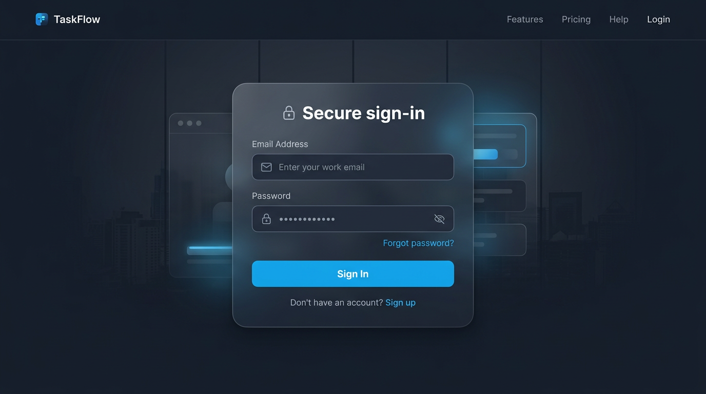
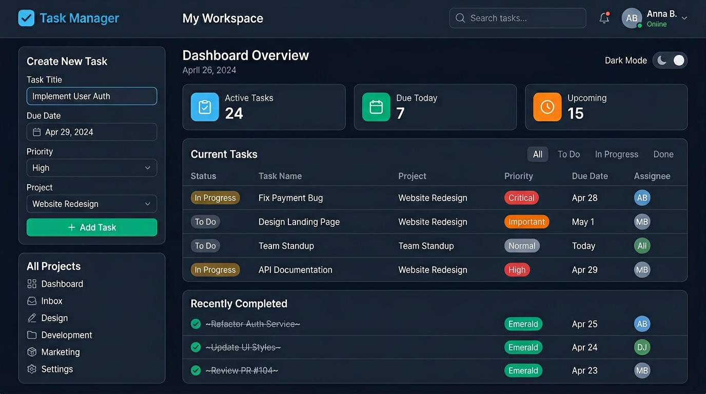

# Task Manager

A portfolio-oriented task manager built with React, TypeScript, Vite, Firebase Authentication, Firestore, and Tailwind CSS.

The app now supports authenticated task ownership with Firebase email/password sign-in, Firestore-backed CRUD, persisted dark mode, and visible loading and error states around async actions.

## Current Status

- Email/password sign up and sign in with Firebase Authentication
- Create, read, update, delete, complete, and reopen tasks
- Task ownership stored as `ownerId = auth.currentUser.uid`
- Firestore rules checked into the repo in `firestore.rules`
- Explicit Firebase environment configuration via `.env.local`
- Responsive Tailwind UI with summary cards and split active/completed task sections
- Persisted dark mode preference

## Release

1. Run `npm run lint` and `npm run build` locally.
2. Follow `docs/manual-release-checklist.md` for functional checks.
3. Deploy Firestore rules and Hosting with Firebase CLI: see `docs/firebase-deploy.md`.
4. After deploy, add your Hosting URL to the **Portfolio** section below (and use that same origin in social previews if you switch `og:image` to an absolute URL).

## Known Limitations

- Validation is still manual in this repo state; automated tests have not been added.
- Timestamps are still stored as ISO strings from the client rather than Firestore server timestamps.
- Existing demo-owned task documents should be treated as disposable old data, not migrated production records.

## Stack

- React 19
- TypeScript
- Vite
- Firebase Authentication
- Firebase Firestore
- Tailwind CSS v4

## Setup

### Prerequisites

- Node.js 20+ recommended
- npm
- A Firebase project with Authentication and Firestore enabled

### Install

```bash
npm install
```

### Firebase configuration

1. Copy `.env.example` to `.env.local`.
2. Fill in your Firebase project values.
3. In Firebase Authentication, enable the Email/Password sign-in provider.
4. In Firestore, deploy the checked-in rules from `firestore.rules` (see `docs/firebase-deploy.md`). Optional: copy `.firebaserc.example` to `.firebaserc` and set your project id before deploying.

Environment variables used:

- `VITE_FIREBASE_API_KEY`
- `VITE_FIREBASE_AUTH_DOMAIN`
- `VITE_FIREBASE_PROJECT_ID`
- `VITE_FIREBASE_STORAGE_BUCKET`
- `VITE_FIREBASE_MESSAGING_SENDER_ID`
- `VITE_FIREBASE_APP_ID`
- `VITE_FIREBASE_MEASUREMENT_ID`

All required Firebase values must be supplied explicitly in `.env.local`.
If any required value is missing, the app shows a setup screen instead of connecting to an unintended project.

### Run locally

```bash
npm run dev
```

## Data Model

Firestore collection: `tasks`

Each document contains:

```json
{
  "text": "Ship portfolio refresh",
  "description": "Replace placeholder README and finish screenshots",
  "category": "Work",
  "priority": "high",
  "ownerId": "firebase-auth-uid",
  "completed": false,
  "createdAt": "2026-04-16T18:20:00.000Z",
  "updatedAt": "2026-04-16T18:20:00.000Z"
}
```

More detail is documented in `docs/firestore-setup.md`.

## Authorization Model

- The UI queries `tasks` where `ownerId == <signed-in-user-uid>`.
- New tasks derive `ownerId` from the authenticated Firebase user instead of browser-local storage.
- Firestore rules require authentication and verify that task ownership matches `request.auth.uid`.
- If Firestore requests an index or setup change, create it in the Firebase console and retry.

## Validation Checklist

Use `docs/manual-release-checklist.md` before calling the project release-ready.

## Portfolio

- **Live URL:** replace with your Firebase Hosting URL after deploy (for example `https://<project-id>.web.app`).
- **Social preview:** `index.html` references `/og-share.png` (served from `public/og-share.png`). Some platforms prefer an absolute URL; set that when you know your production origin.

### Screenshots

Auth (email/password):



Dashboard (tasks and create form):



These files live under `docs/screenshots/`. Swap them for real captures of your deployed UI whenever you iterate on design; see `docs/screenshots/README.md`.
